**NOMS/Prénoms des étudiants ayant rédigé ce rapport : Soupaya Valliama Raphael**

**ESIROI 4A Informatique - S7**

# **Challenge DATA**

Compte-rendu de réalisation - Livrable pour l’évaluation des compétences

*Vous devez obligatoirement compléter toutes les parties suivantes avec des éléments issus de vos travaux. Si vous le jugez nécessaire, vous pouvez créer une ou des partie(s) supplémentaire(s).* 

*Dans chaque partie, la liste des éléments attendus n’est pas exhaustive : vous pouvez la compléter si vous le souhaitez. Vous devez également créer des paragraphes.*

Légende pour l’évaluation des compétences :

**A** : acquis / **ECA** : en cours d’acquisition / **NA** : non acquis

## **1. Tâche 1 - Construction d'un jeu de données**

|**Compétences visées**|**A**|**ECA**|**NA**|
| :- | :-: | :-: | :-: |
|DATA - Concevoir, développer et utiliser des outils et des applications intégrant la gestion des données et leur valorisation||||
|DATA - Appliquer les méthodes d'analyse des données multimédia (images, signaux) ||||

*Éléments attendus (liste non exhaustive) : logigramme de la solution, extrait de code pour le chargement des données depuis le cluster HDFS et le calcul des attributs synthétiques depuis une série temporelle, capture d’écran des données transformées et des dossiers/fichiers produits en sortie…*

### **Tâche 1 : Extraction et traitement des données depuis HDFS**

**Objectif de la tâche :**
La Tâche 1 consiste à extraire des données temporelles stockées sur un cluster HDFS, à calculer des statistiques spécifiques pour chaque attribut, et à sauvegarder ces données agrégées dans des fichiers CSV.

**Logigramme**
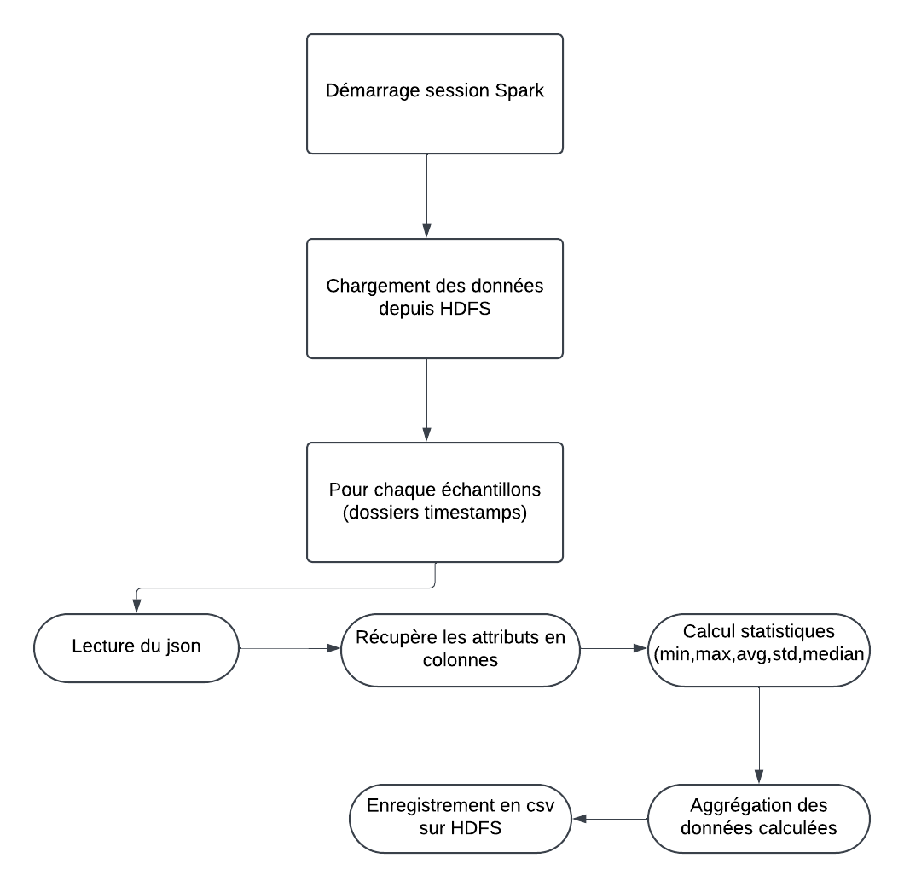

### **Description de l’approche**

#### 1. **Chargement des données et initialisation de Spark**
   La première étape du processus consiste à utiliser Spark pour gérer la lecture et le traitement des fichiers depuis HDFS. Spark permet de traiter efficacement les grands volumes de données.
   
#### 2. **Extraction des statistiques par attribut**
   Une fonction dédiée, ___extraction(df, attributes)___, est utilisée pour calculer cinq statistiques pour chaque attribut du jeu de données :
   1. **Min** : valeur minimale de l’attribut,
   2. **Max** : valeur maximale,
   3. **Moyenne** : moyenne des valeurs,
   4. **Écart-Type** : écart-type des valeurs de l’attribut,
   5. **Médiane** : valeur médiane de l’attribut.

Cette fonction prend en entrée un DataFrame Spark (correspondant aux données d’un échantillon) et une liste d’attributs. Elle retourne un DataFrame contenant les statistiques calculées pour chaque attribut.

*Extrait du code :*
```python
# Fonction d'extraction
def extraction(df, attributes):
    # Calcul des statistiques pour chaque attribut dans chaque échantillon
    aggregations = []
    for attribute in attributes:
        aggregations.extend([
            min(attribute).alias(f"{attribute}_min"),
            max(attribute).alias(f"{attribute}_max"),
            avg(attribute).alias(f"{attribute}_avg"),
            stddev(attribute).alias(f"{attribute}_std"),
            median(attribute).alias(f"{attribute}_median")
        ])
    return df.agg(*aggregations) # Utilise * pour considérer chaque élément de la liste d'aggregations comme un argument distinct dans df.agg()
```


#### 3. **Traitement et agrégation des données** La fonction principale, ___traitement\_data(data, dtype)___, exécute les étapes suivantes :
   1. **Chargement des fichiers depuis HDFS** : Cette fonction lit les fichiers JSON depuis HDFS en fonction des paramètres data (anomalies ou non-anomalies) et dtype (Features ou GraphFeatures).
   2. **Extraction des attributs** : Pour chaque fichier, la fonction identifie les attributs et les passe à la fonction extraction pour calculer les statistiques.
   3. **Agrégation des résultats** : Les résultats pour chaque échantillon sont ensuite accumulés dans un DataFrame final.
   4. **Sauvegarde des résultats** : Le DataFrame agrégé est sauvegardé sous format CSV dans un répertoire spécifique sur HDFS pour permettre des analyses ultérieures.

*Extrait du code :*
```python
# Fonction de traitement principal
def traitement_data(data, dtype="Features"):
    # Chemin HDFS vers les données échantillon
    path = f"hdfs://localhost:9000/shared/data/{data}/*/transform/{dtype}/*.json"
    
    # Chemins de chaque échantillon (récupère le premier élément de la paire (chemin, contenu))
    sample_paths = spark.sparkContext.wholeTextFiles(path).keys().collect()

    # DataFrame pour accumuler les résultats de chaque échantillon
    results = None

    # Calcul des statistiques pour chaque échantillon (chaque dossier de timestamp)
    for sample_path in sample_paths:
        # Un fichier JSON pour un échantillon
        df_sample = spark.read.json(sample_path)
        
        # Liste des attributs dans le fichier
        attributes = df_sample.columns  
        
        # Calcul pour l'échantillon
        stats = extraction(df_sample, attributes)
        
        # Ajout des résultats au DataFrame final
        results = stats if results is None else results.union(stats)

    # Chemin de sauvegarde des résultats
    output_path = f"hdfs://localhost:9000/user/jupyter-raphael.soupaya/data_{dtype}/{data}"
    
    # Sauvegarde des résultats en CSV
    results.coalesce(1).write.csv(output_path, header=True, mode="overwrite") # coalesce(1) pour forcer Spark à produire un unique fichier csv (évite un genre de partionnement)
```

En terme d'implémentation, la fonction de traitement est appelée dans une boucle afin d'itérer soit sur les anomlies de type 'Features' soit de type 'GraphFeatures'.

*Extrait du code :*
```python
# Exécution de l'extraction pour chaque type d'anomalie
data_types = ["leaks", "outages", "hijack", "no_anomaly"]
for data_type in data_types:
    # Extraction pour les features
    # traitement_data(data_type, dtype="Features")
    # Extraction pour les graphes
    traitement_data(data_type, dtype="GraphFeatures")
```

### **Résultats et Analyse**

Les fichiers CSV résultants contiennent les statistiques de chaque attribut pour les différents échantillons. Ces statistiques permettent d’avoir une vue globale sur chaque attribut et d’identifier d’éventuelles tendances dans les données.

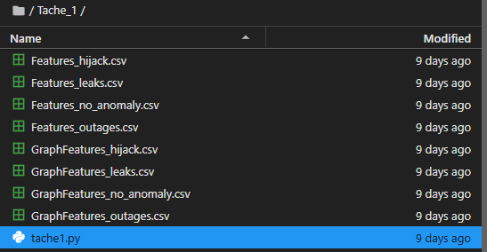

## **2. Tâche 2 - Analyse descriptive**

|**Compétences visées**|**A**|**ECA**|**NA**|
| :- | :-: | :-: | :-: |
|DATA - Concevoir, développer et utiliser des outils et des applications intégrant la gestion des données et leur valorisation||||
|DATA - Définir, mettre en œuvre et utiliser une analyse descriptive et prédictive en exploitant des données massives||||

*Éléments attendus (liste non exhaustive) : logigramme du traitement appliqué aux données, boites à moustaches pour chaque combinaison de type anomalie / type d’attribut, paragraphes discutant les résultats obtenus / la méthodologie / les pistes d’amélioration…*

### Tâche 2 - Préparation et visualisation des données

**Objectif de la tâche :** La Tâche 2 a pour objectif de nettoyer, normaliser, et visualiser les données extraites de HDFS.

**Logigramme**
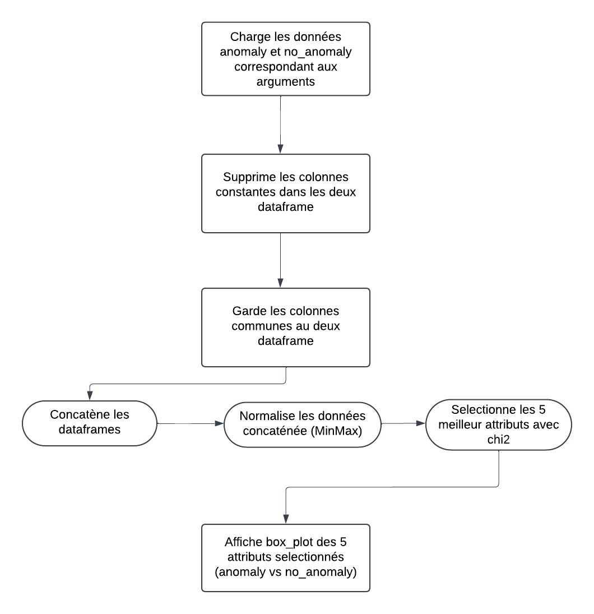

### Description de l'approche

#### 1. **Chargement des données** :
La première étape consiste à charger les données à partir des fichiers CSV stockés sur le HDFS. La fonction ___load_data(type, attribute)___ s’occupe de cette opération en permettant de sélectionner des fichiers spécifiques, en fonction du type d'attribut (Features ou GraphFeatures) ainsi que de l'anomalie (leaks, hijack, outages). Cette fonction facilite ainsi le traitement combiné de chaque catégorie d'anomalie avec les données de "no_anomaly".

*Extrait du code :*
```python
def load_data(type, attribute):
    return pd.read_csv(f"../Tache_1/{type}/{attribute}.csv")
```

#### 2. **Filtrage des constantes** :
La fonction ___remove_constante(df)___ est utilisée pour identifier et éliminer les colonnes constantes, c'est-à-dire les attributs dont la variance est nulle. Ces colonnes sont sans intérêt pour les modèles de machine learning car elles ne fournissent aucune information discriminante. Cette étape réduit la dimensionnalité des données.

*Extrait du code :*
```python
def remove_constante(df):
    '''
        Vérifie tout le dataframe par rapport à la première ligne
        L'inégalité vérifie si les valeurs d'une colonne varient 
        (cad : Si la valeur de la colonne à la première ligne est au moin différent une fois sur une autre ligne)
        Cela donne un masque booléen (un dataframe de True/False)
        any() est ensuite utilise pour checker sur chaque colonne si il y a au moin 1 True (colonne non constante)
        Renvoie True si c'est le cas, False sinon
        Finalement on ne garde que les colonnes True (cela enlève les colonnes constantes)
    '''
    return df.loc[:, (df != df.iloc[0]).any()]
```

#### 3. **Normalisation des données** :
La fonction ___minmax(data)___ applique une normalisation Min-Max sur les données. Cette technique assure que toutes les variables se trouvent dans la même échelle (de 0 à 1), facilitant ainsi l’entraînement des modèles et améliorant leur précision en prenant en compte les écarts d’échelle entre les variables. Le DataFrame résultant conserve les colonnes et index d'origine, mais avec des valeurs mises à l’échelle.

*Extrait du code :*
```python
def minmax(data):
    scaler = MinMaxScaler()
    data_normalized = scaler.fit_transform(data)
    return pd.DataFrame(data_normalized, columns=data.columns)
```

#### 4. **Selection d'attribut avec Chi2** : 
La fonction ___chi_2(data1, data2, k=5)___ s'occupe de déterminer les k (ici 5) attributs les plus importants par rapport à nos labels (1 : anomaly et 0 : no\_anomaly). De cette manière pour chaque couple d'anomaly et de no\_anomaly que l'on peut former a partir de Features et GraphFeatures on obtient les attributs les plus "représentatifs" pour la classification.

*Extrait du code :*
```python
def chi_2(data1, data2, k=5):
    # Considère uniquement les colonnes communes aux deux DataFrames
    commun = data1.columns.intersection(data2.columns)
    data1 = data1[commun]
    data2 = data2[commun]

    # Concatène les deux jeux de données pour une normalisation cohérente
    combined_data = pd.concat([data1, data2], ignore_index=True)
    combined_data = minmax(combined_data)  # Normalisation des données combinées
    labels = np.array([0] * len(data1) + [1] * len(data2))

    # Vérification des NaN
    if combined_data.isnull().values.any():
        print("Attention : Valeurs NaN")
    
    # Sélection des attributs avec chi2
    selector = SelectKBest(chi2, k=k)
    selector.fit(combined_data, labels)
    selected_features = combined_data.columns[selector.get_support(indices=True)]
    
    # Séparation des données normalisées après sélection des features
    no_anomaly = combined_data.iloc[:len(data1)][selected_features]
    anomaly = combined_data.iloc[len(data1):][selected_features]
    
    return no_anomaly, anomaly, selected_features
```

#### 5. **Visualisation des données** :
Pour comprendre la distribution et détecter des valeurs aberrantes potentielles, la fonction ___plot_boxplots(data1, data2, selected_features, anomaly_type)___ génère des graphiques boxplots. Ces boxplot représentent les distribution pour chacunes des 5 colonnes selectionnées par le chi2 et confronte les distribution anomaly vs no\_anomaly.

```python
def plot_boxplots(data1, data2, selected_features, anomaly_type):
    # Combine les données avec une colonne pour distinguer les deux types
    data_combined = pd.concat([data1.assign(Type='no_anomaly'), data2.assign(Type=anomaly_type)], ignore_index=True)
    
    # Transforme les données pour un format dapté aux boxplots [Type, Variable, Valeur]
    data_melted = data_combined.melt(id_vars=['Type'], value_vars=selected_features, var_name='Attribut', value_name='Valeur normalisée')
    
    # Création du boxplot
    plt.figure(figsize=(12, 10))
    sns.boxplot(x='Attribut', y='Valeur normalisée', hue='Type', data=data_melted)
    plt.title(f'Boxplot des 5 meilleurs attributs - Anomalie : {anomaly_type}')
    plt.xlabel('Attributs')
    plt.ylabel('Valeur normalisée')
    plt.xticks(rotation=45)
    plt.legend(title='Type')
    plt.tight_layout()
    plt.show()
```

#### 6. **Fonction principale :** La fonction ___analyze_data(attribute_type, anomaly_type)___ rassemble l’ensemble des étapes précédentes en une seule fonction, créant un flux de travail pour chaque argument de type d'attribut et type d'anomaly.

```python
def analyze_data(attribute_type, anomaly_type):
    # Charge les données sans anomalies
    no_anomaly = load_data(attribute_type, "no_anomaly")

    # Charge les données d'anomalies
    anomaly = load_data(attribute_type, anomaly_type)
    
    # Remove constant columns
    no_anomaly = remove_constante(no_anomaly)
    anomaly = remove_constante(anomaly)

    # Select k best features
    no_anomaly_best, anomaly_best, selection = chi_2(no_anomaly, anomaly)

    # Visualization
    plot_boxplots(no_anomaly_best, anomaly_best, selection, anomaly_type)
```

### Résultats et analyse

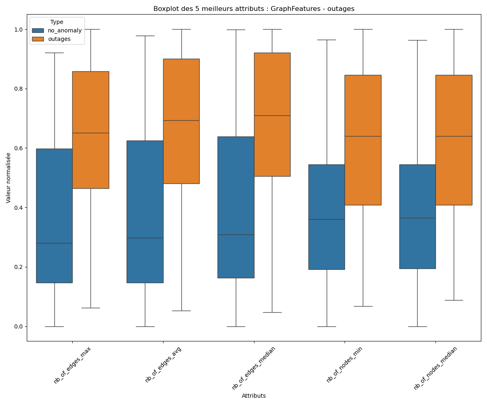

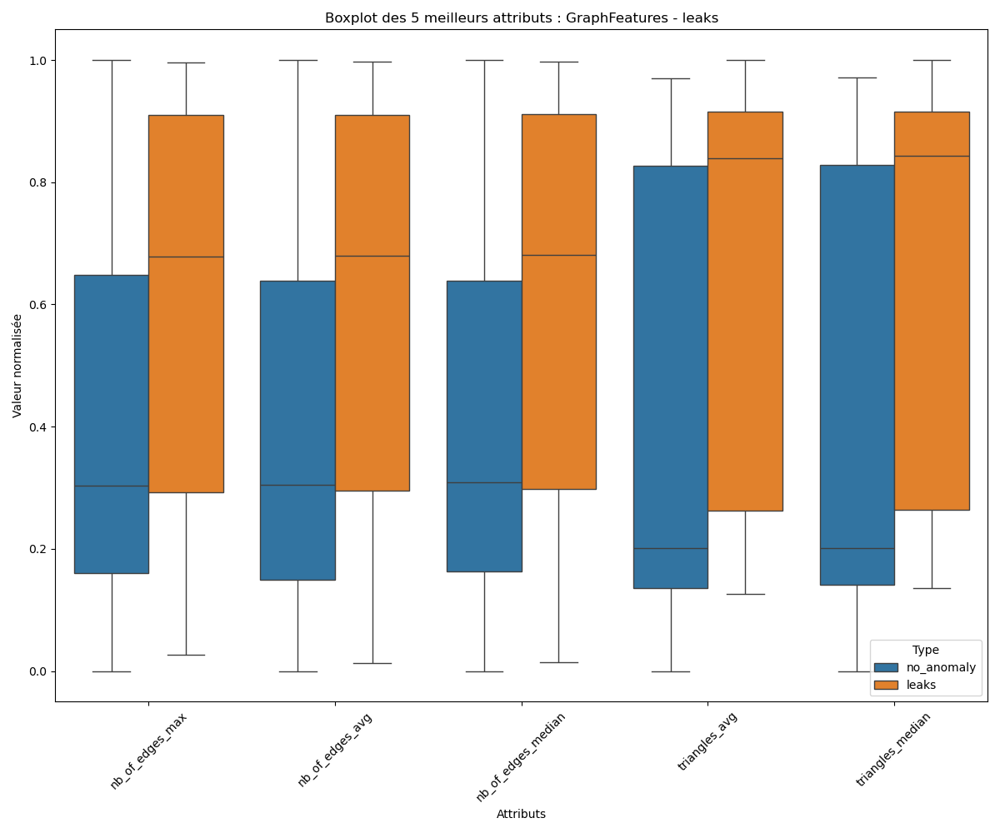


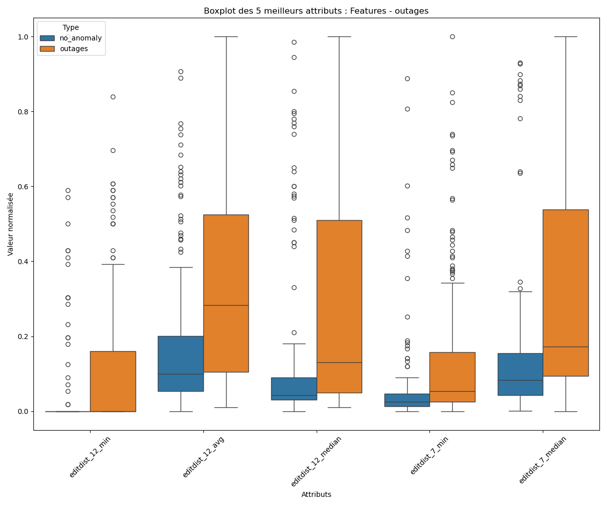

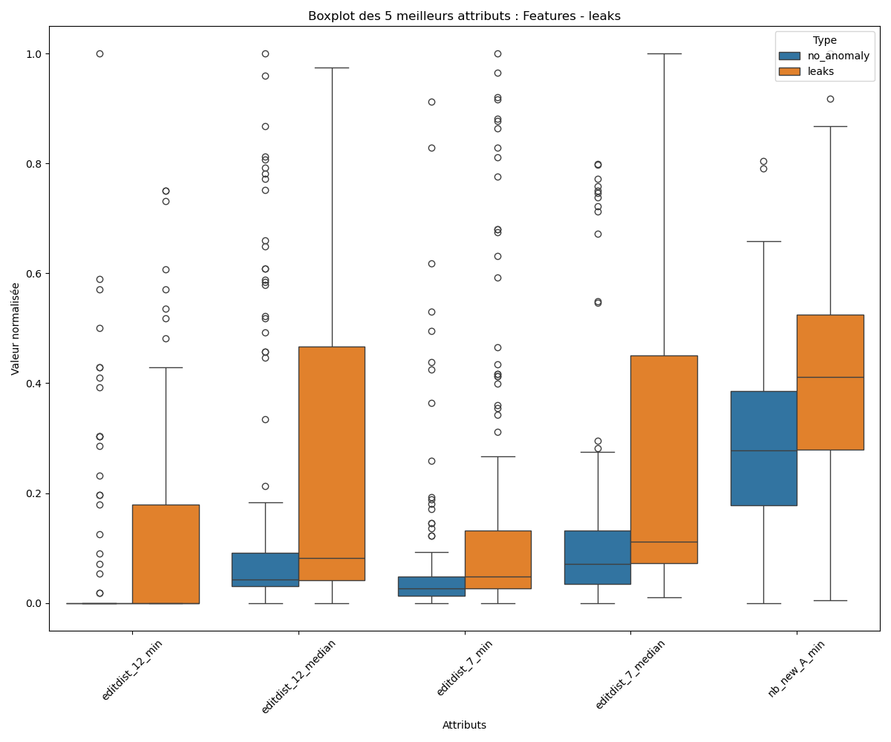

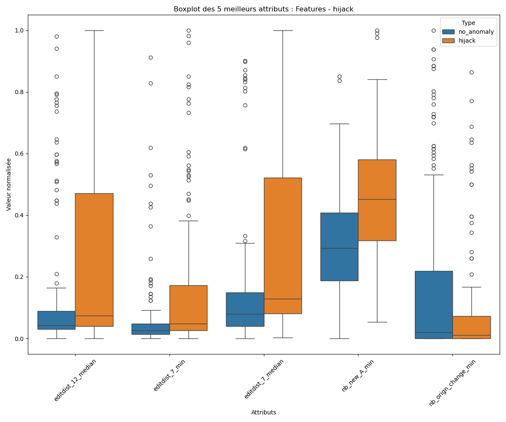

#### 1. **Différenciation anomaly vs no\_anomaly**
Les boxplots permettent de visualiser les différences de distribution entre les anomalies et les données sans anomalies. Sans faire du cas par cas, les box-plots nous montrent de manière générales une certaines différence entre les distribution dans des cas d'anomalies et de non anomalies. Ce genre d'attributs (par exemple : ___editdist_12_median___ de *Features-hijack*) sont des variables discriminantes dans un modèle de classification.

#### 2. **Importance de la variabilité et des valeurs extrêmes**
Les boxplots mettent en évidence la variabilité des valeurs pour chaque attribut ainsi que la présence de valeurs extrêmes, outliers (par exemple : ___editdist_12_median___ et ___editdist_7_median___ de *Features-outages*).  Dans le contexte de l’apprentissage automatique, une variabilité élevée ou la présence de nombreux outliers peut indiquer des fluctuations importantes dans les données, souvent associées à des événements anormaux ou à des anomalies spécifiques. Ainsi ce genre d'évenement n'est pas représentatif du comportement habituel et donc ne fait que d'incorporer du bruit à notre jeu de donnée. Cela se voit clairement sur les box_plot, où, dans le cas de ___editdist_12_median___ de *Features-outages*, la boite du no\_anomaly est complètement écrasé proche du zero. 

#### 3. **Conclusion et amélioration possible**
Les différences de distributions observées dans les boxplots influence le choix des algorithmes d’apprentissage. Comme vu précedemment, certains attributs montrent des variations importantes entre les classes. Ainsi, on pourrai favoriser l’utilisation de modèles linéaires ou d’arbres de décision, qui exploitent ces différences pour la séparation des classes. De plus il serait peut être pertinent d'effectuer un traitement sur les outliers notamment dans les données de type "Features" ou encore d'utiliser un autre scaler que le MinMax pour éviter cette "applatissement" sur le 0. (un scaler à base logarithmique peut être).

## 3. Tâche 3 - Apprentissage automatique

|**Compétences visées**|**A**|**ECA**|**NA**|
| :- | :-: | :-: | :-: |
|DATA - Concevoir, développer et utiliser des outils et des applications intégrant la gestion des données et leur valorisation||||
|DATA - Définir, mettre en œuvre et utiliser une analyse descriptive et prédictive en exploitant des données massives||||

*Éléments attendus (liste non exhaustive) : logigramme du pipeline d'apprentissage automatique, tableaux présentant les résultats pour chaque combinaison de type anomalie / type d’attribut, les résultats obtenus / la méthodologie / les pistes d’amélioration...*

### Tâche 3 - Pipeline de l'apprentissage automatique

**Objectif de la tâche :** La Tâche 3 vise à construire un pipeline de machine learning pour classifier les données entre anomalies et non anomalies. Cette tâche utilise les types d'attributs (features ou graphfeatures) et un type d'anomalie parmi leaks, outages, et hijack. Le pipeline s'appuie sur des modèles d'apprentissage supervisé avec optimisation par validation croisée.

**Logigramme**
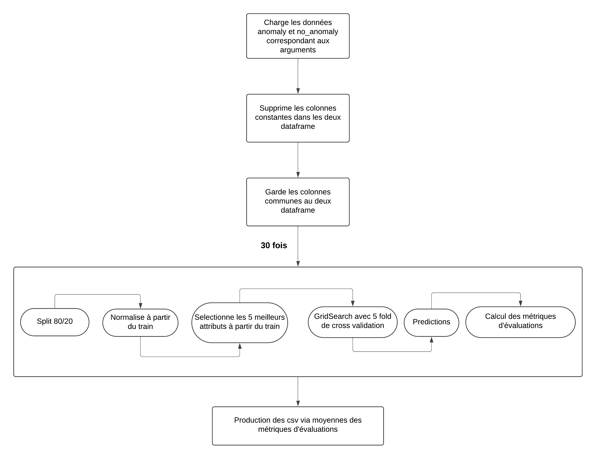

### Description de l'approche

1. **Chargement et préparation des données** :
Les données sont chargées en fonction des arguments fournis en ligne de commande, spécifiant le type d'attribut (features ou graphfeatures) et le type d'anomalie. Ensuite, une étape de suppression des colonnes constantes est appliquée pour éliminer toute attributs constants. Les jeux de données de l'anomalie choisie et des données sans anomalies sont finalement combinés. 

*Extrait du code (même code que la tache 2) :*

```python
def load_data(atype, attribute):
    return pd.read_csv(f"../Tache_1/{atype}/{attribute}.csv")

def remove_constante(df):
    return df.loc[:, (df != df.iloc[0]).any()]
```

2. **Séparation des données et normalisation** : 
Les données combinées sont séparées en ensembles d'entraînement (80%) et de test (20%). Les données d'entrainement sont ensuite normalisées avec un MinMaxScaler pour standardiser les valeurs entre 0 et 1. Le meme Scaler est utilisé est ensuite appliqué au données de l'ensemble de test pour garder une cohérence entre les données.

*Extrait du code (minmax modifié par rapport à la tache 2) :*

```python
# Séparation train/test
X_train, X_test, Y_train, Y_test = train_test_split(X, Y, test_size=0.2)

# Nouvelle fonction minmax
def split_minmax(data_train, data_test):
    scaler = MinMaxScaler()
    data_train_normalized = scaler.fit_transform(data_train)
    data_test_normalized = scaler.transform(data_test)
    return pd.DataFrame(data_train_normalized, columns=data_train.columns), pd.DataFrame(data_test_normalized, columns=data_test.columns)
```

3. **Sélection de caractéristiques (optionnel)** :
Si on souhaite réduire la dimension des attribut sur lesquels on va entrainer et tester nos modèles, la fonction split\_chi_2 applique une sélection des 5 meilleurs attributs, permettant de réduire le nombre de colonnes en conservant les plus significatives. Le même Selector est appliqué au données de test. Cela améliore nettement la vitesse de calcul lors des entrainements.

*Extrait du code (minmax modifié par rapport à la tache 2) :*

```python
def split_chi_2(data_train, labels, data_test, k=5):
    # Sélection des attributs avec chi2
    selector = SelectKBest(chi2, k=k)
    data_train_select = selector.fit_transform(data_train, labels)
    data_test_select = selector.transform(data_test)
    selected_features = data_train.columns[selector.get_support(indices=True)]
    
    return pd.DataFrame(data_train_select, columns=selected_features), pd.DataFrame(data_test_select, columns=selected_features)
```

4. **Évaluation des modèles** :
Les performances des modèles sont évaluées sur les données de test, et les scores de précision, rappel et accuracy sont calculés. Cette évaluation est répétée 30 fois pour chaque modèle afin de calculer un écart-type des résultats, garantissant la fiabilité des mesures de performance. Chaque répétition un splitting de donnée est effectué, et un GridSearch avec une cross-validation de 5 folds est lancé pour déterminer les meilleurs hyperparamètres des modèles par itération.

*Extrait du code :*

```python
    for _ in range(30):
        
        # Train/Test Split
        X_train, X_test, Y_train, Y_test = train_test_split(X, Y, test_size=0.2)

        # Normalisation de l'ensemble d'entraînement et application sur l'ensemble de test
        X_train_normalized, X_test_normalized = split_minmax(X_train, X_test)

        # Sélection des meilleurs attributs avec chi2 sur les données normalisées
        # X_train_selected, X_test_selected = split_chi_2(X_train_normalized, Y_train, X_test_normalized)
        
        for model_name, (model, params) in models.items():
            # Recherche des meilleurs hyperparamètres avec GridSearch
            grid = GridSearchCV(model, params, scoring='accuracy', cv=5)
            grid.fit(X_train_normalized, Y_train)
            best_model = grid.best_estimator_

            # Ajoute les meilleurs paramètres trouvé à chaque fois
            best_params[model_name].append(grid.best_params_)
            
            # Prédictions
            Y_pred_train = best_model.predict(X_train_normalized)
            Y_pred_test = best_model.predict(X_test_normalized)
```
On stock les évaluations dans un dataframe "results".

*Extrait du code :*
```python
            # Calcul des métriques
            results[model_name]['train_accuracy'].append(accuracy_score(Y_train, Y_pred_train))
            results[model_name]['test_accuracy'].append(accuracy_score(Y_test, Y_pred_test))
            results[model_name]['train_precision'].append(precision_score(Y_train, Y_pred_train))
            results[model_name]['test_precision'].append(precision_score(Y_test, Y_pred_test))
            results[model_name]['train_recall'].append(recall_score(Y_train, Y_pred_train))
            results[model_name]['test_recall'].append(recall_score(Y_test, Y_pred_test))
```

Une partie du code écrit dans un fichier 'best_params.txt' à chaque fois les meilleurs paramètres choisis par le GridSearch à chaque itération (30 fois) pour chacun des modèles. Cela permet d'avoir une visualisation des paramètres choisis à chaque fois.

*Extrait du code :*

```python
    
    with open("best_params.txt", "w") as f:
        for model_name, params_list in best_params.items():
            f.write(f"\nMeilleurs parametres pour {model_name} :\n")
            for i, params in enumerate(params_list, 1):
                f.write(f"  Repetition {i}: {params}\n")
```

5. **Aggrégation et sauvegarde des métriques** : 
En fin de code, on aggrége chaque métriques, en faisant la moyenne des évaluations et on rajoute l'écart type associé. On ajoute ces données dans notre dataframe de présentation finale. Le dataframe est remanié pour une présentation proche à celle du pdf avant d'être convertit en fichier csv.

*Extrait du code :*

```python
# Calcul des moyennes et écarts types
    description = []
    for model_name, metrics in results.items():
        # Une ligne pour chaque modèle et chaque métrique (Moyenne ± Écart-Type)
        description.append({
            'Model': model_name,
            'Train Accuracy': f"{np.mean(metrics['train_accuracy']):.3f} ± {np.std(metrics['train_accuracy']):.3f}",
            'Test Accuracy': f"{np.mean(metrics['test_accuracy']):.3f} ± {np.std(metrics['test_accuracy']):.3f}",
            'Train Precision': f"{np.mean(metrics['train_precision']):.3f} ± {np.std(metrics['train_precision']):.3f}",
            'Test Precision': f"{np.mean(metrics['test_precision']):.3f} ± {np.std(metrics['test_precision']):.3f}",
            'Train Recall': f"{np.mean(metrics['train_recall']):.3f} ± {np.std(metrics['train_recall']):.3f}",
            'Test Recall': f"{np.mean(metrics['test_recall']):.3f} ± {np.std(metrics['test_recall']):.3f}"
        })
    
    # Création du DataFrame
    df_results = pd.DataFrame(description)
    
    # Ajustement de l'ordre des colonnes
    df_results = df_results[
        [
            'Model', 
            'Train Accuracy', 'Test Accuracy', 
            'Train Precision', 'Test Precision', 
            'Train Recall', 'Test Recall'
        ]
    ]
    
    # Sauvegarder en CSV
    df_results.to_csv('model_performance_2.csv', index=False)
```

### Résultats et discussions

#### 1. pipeline.py vs pipeline_chi2

Dans un premier temps une évaluation de performance entre les deux pipelines (avec et sans selection d'attribut) est effectué. C'est une bonne habitude de chercher à réduire la dimensionnalité des problèmes d'apprentissage automatiques. Néanmoins il faut faire attention aux performances de prédiction du modèle. 

Afin de tester les performances, les données sont split avec les même seed lors des même itérations d'entrainement dans pipeline et pipeline_chi2.

*Extrait du code :*

```python
    ...
    
    for i in range(30):
        
        # Train/Test Split
        X_train, X_test, Y_train, Y_test = train_test_split(X, Y, test_size=0.2, random_state=97490+i)
        
        ...
```

Ainsi, lors de nos 30 itérations, un **random_state** identique par itération sur les deux pipelines assure la meme séparation des données. Pour montrer la différence de performances nous prendrons l'exemple GraphFeature - outages (*Le comportement est généralement le même suivant les combinaisons possible*).

**Sans chi2 :** 

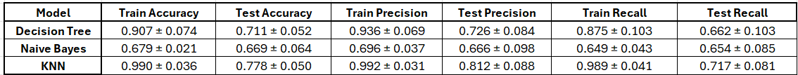

**Avec chi2 :** 

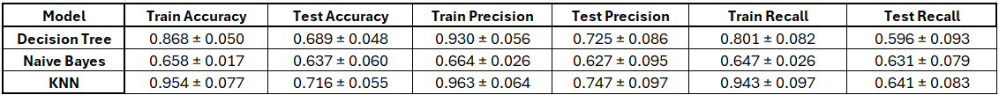

Pour tous les modèles, l'absence de sélection de caractéristiques Chi2 donne de meilleures performances. Les différences sont relativement minimes en prenant en compte les écart-type, bien qu'elles semblent plus marquées pour KNN. Cela suggère que la sélection Chi2 a pu exclure des caractéristiques utiles, impactant les performances. Néanmoins, en prenant du recul, les écarts de performances restent très minimes, de plus il faut noté que le pipeline avec la selection chi2 à un temps d'execution nettement plus court que le pipeline sans. 

*Extrait du code :*

```python
import timeit
if __name__ == "__main__":
    parser = argparse.ArgumentParser(description='Entrainement et évaluation')
    parser.add_argument('attribute_type', type=str, help='Type d\'attribut (Features ou GraphFeatures)')
    parser.add_argument('anomaly_type', type=str, help='Type d\'anomalie (leaks, outages, hijack)')
    args = parser.parse_args()
    
    execution_time = timeit.timeit(lambda: train_and_evaluate(args.attribute_type, args.anomaly_type), number=1)
    print(f"Temps d'exécution : {execution_time} secondes")
```


**Temps d'exécution sans chi2 :** 53.4898 secondes

**Temps d'écution avec chi2 :** 38.9073 secondes

Ainsi, de par la faible différence de performances et du temps d'execution beaucoup plus court, dans la suite de ce rapport nous utiliserons les résultats du pipeline avec chi2. Une perspective d'amélioration serait peut être élargir le nombre d'attribut à selectionner en faisant attention au phénomène de sur-apprentissage.

*N.B : Une amélioration du code serait peut être ne pas re-selectionner les 5 meilleurs attributs à chaque fois qu'on split*

#### 2. Analyse des anomalies par attribut

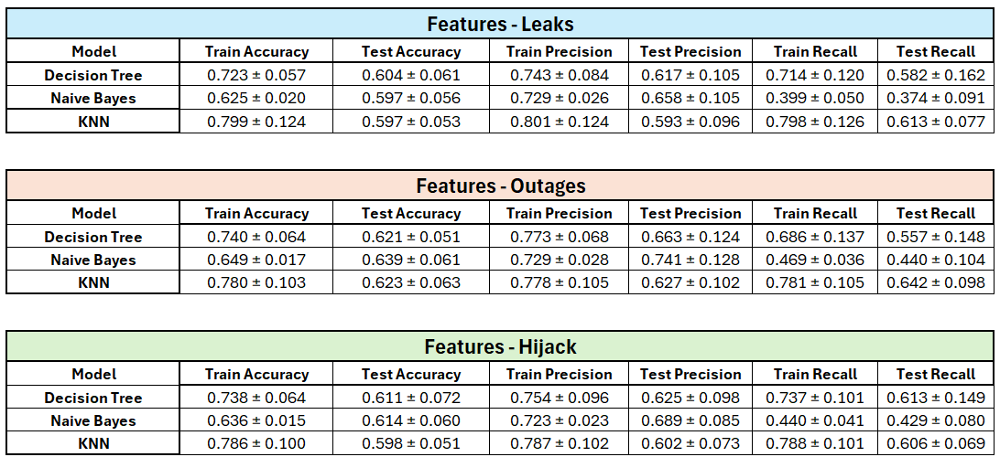

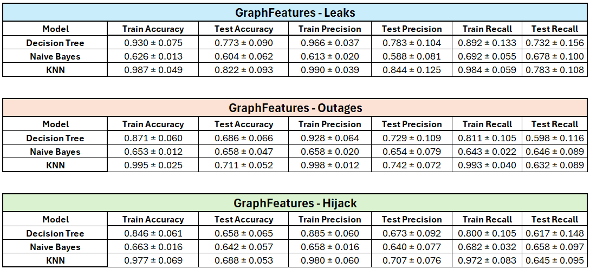

___features_leaks___

Les modèles montrent une accuracy et un recall de test relativement faibles. Cette combinaison rencontre des difficultés pour généraliser sur les données nouvelles, ce qui peut indiquer que les modèles ne sont pas bien adaptés pour capturer les caractéristiques spécifiques des leaks. La variabilité élevée du recall en test montre une inconsistance dans l’identification correcte des anomalies.

___features_outages___

On remarque es améliorations par rapport à la détection des leaks, avec une meilleur accuracy et un meilleur recall en général. Il y a une meilleure généralisation des modèles comparé aux leaks, indiquant que les caractéristiques des outages sont mieux capturées que celles des leaks.

___features_hijack___

La détection des hijack produisent des performances de test relativement faibles. Cela indique des difficultés pour généraliser à ce type d’anomalie avec les attributs de base. La variabilité du rappel met en évidence une incertitude dans l’identification d'hijack réel.

___graphfeatures_leaks___

Avec de grande valeur d'accuracy, precision et recall sur les données de train comparé à des résultats nettement moin bon sur les données de test, cela suggère un problème d'overfitting des modèles globalement. On notera tout de même que les valeur d'accuracy, precision et recall restent bien meilleur que les données features précédent.

___graphfeatures_outages____

Ici encore les performances sur les données de train sont beaucoup plus élevées que sur les tests. l'accuracy et la precision par rapport aux leaks propose de bonnes performances mais le recall inférieur peut laisser sous entendre la difficulté globale de reconnaitre un outages.


___graphfeatures_hijack___

Semblable aux autres performances des graphfeatures, ici aussi le recall est plus faible que les leaks mais globalement de meilleurs performances que les features.


___Conclusion___

L’analyse montre que les graphfeatures offrent des avantages significatifs par rapport aux attributs features, notamment pour la détection des leaks qui vont être le type d'anomaly les moins "raté par les modèles". Les outages bénéficient nettement plus des attributs de graphes que des features standards. En conclusion, pour maximiser la capacité de détection d’anomalies, il est recommandé de privilégier l’utilisation d’attributs de graphes.


#### 3. Discussion du choix de modèle

1. **Modèle KNN** : Ta

Obtient les meilleures performances pour les deux types d'attributs (Features et GraphFeatures) et sur les trois types d'anomalies :

- ___GraphFeatures - Leaks___ : KNN atteint une précision de test élevée (0.844 ± 0.125) et un bon recall (0.783 ± 0.108), ce qui en fait un choix solide.

- ___GraphFeatures - Outages___ : KNN a une précision de test de 0.742 ± 0.072, qui est supérieure aux autres modèles, et un recall élevé, ce qui le rend fiable pour la détection d'anomalies de type outages.

- ___GraphFeatures - Hijack___ : Les performances de KNN en termes de précision (0.707 ± 0.076) et de recall (0.645 ± 0.095) restent élevées.

Pour les attributs de type "Features", KNN reste également performant, mais avec des performances globalement inférieures à celles obtenues sur les GraphFeatures. Par exemple, pour ___"Features - Outages"___, KNN a une précision de test de 0.627 ± 0.102 et un recall de 0.642 ± 0.098.

2. **Modèle Decision Tree** :

Decision Tree montre une bonne performance sur les données de type GraphFeatures, notamment avec une précision et un recall élevés pour les anomalies de type leaks et outages. Cependant, ses performances sont généralement inférieures à celles de KNN pour les mêmes paramètres.

- ___GraphFeatures - Leaks___ : Précision de test de 0.783 ± 0.104 et recall de 0.732 ± 0.156, ce qui est bon mais légèrement inférieur à KNN.

- ___GraphFeatures - Outages___ : Avec une précision de test de 0.729 ± 0.064 et un recall de 0.598 ± 0.116, le modèle reste performant mais moins que KNN en termes de rappel, qui est une métrique crucial pour limiter les cas d'anomalie mal classées.

Encore une fois le modèle est moins performant globalement sur les "Features".

3. **Modèle Naive Bayes** :

Le modèle Naive Bayes est généralement le moins performant parmi les trois pour tous les types d'anomalies et d'attributs. Sa précision de test et son rappel sont souvent inférieurs aux autres modèles, ce qui en fait un choix moins idéal pour cette tâche de classification d'anomalies.

- ___GraphFeatures - Leaks___ : Précision de test de 0.588 ± 0.081 et recall de 0.680 ± 0.100.

- ___Features - Outages___ : Précision de test de 0.741 ± 0.128, qui est compétitive, mais ses performances globales restent en deçà de celles de KNN et Decision Tree.

___Conclusion___ :

Pour la classification des anomalies, le modèle KNN avec des attributs de type GraphFeatures semble être le meilleur choix en raison de ses performances élevées en précision et en recall. Les GraphFeatures apportent probablement des informations structurelles et/ou temporelles supplémentaires qui améliorent la détection d'anomalies. 

**Ainsi pour une détection optimale des anomalies, le modèle KNN appliqué aux GraphFeatures principalement semble être le choix privilégié.**